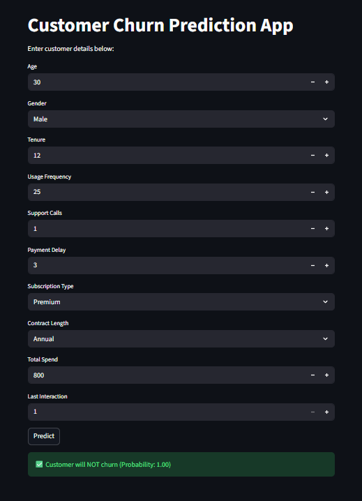

# Customer Churn Prediction System

An end-to-end Machine Learning project that predicts customer churn using customer demographic information, usage behavior, subscription details, and payment patterns.

The system helps businesses identify customers who are likely to leave and enables proactive customer retention strategies.

---

## Project Overview

Customer churn is a major challenge for businesses because losing customers directly impacts revenue and growth.

This project uses Machine Learning models to analyze customer behavior and predict whether a customer is likely to churn.

The final solution is deployed using Streamlit to provide real-time predictions through an interactive web application.

---

## Features

- Customer churn prediction using Machine Learning
- Real-time prediction using Streamlit
- Interactive web interface
- Data preprocessing
- Exploratory Data Analysis (EDA)
- Feature engineering
- Hyperparameter tuning
- Multiple model comparison
- Model performance evaluation

---

## Input Features

The model predicts churn using:

- Age
- Gender
- Tenure
- Usage Frequency
- Support Calls
- Payment Delay
- Subscription Type
- Contract Length
- Total Spend
- Last Interaction

---

## Machine Learning Models Used

- Logistic Regression
- Naive Bayes
- K-Nearest Neighbors (KNN)
- Decision Tree
- Random Forest

---

## Best Model Performance

Random Forest achieved the best performance.

| Metric | Score |
|----------|--------|
| Accuracy | 94% |
| Precision | 0.90 |
| Recall | 1.00 |
| F1 Score | 0.95 |

---

## Tech Stack

- Python
- Pandas
- NumPy
- Scikit-Learn
- Streamlit
- Matplotlib
- Seaborn

---

## Project Workflow

1. Data Collection
2. Data Cleaning
3. Exploratory Data Analysis
4. Feature Engineering
5. Data Splitting
6. Model Training
7. Hyperparameter Tuning
8. Model Evaluation
9. Streamlit Deployment

---

## Streamlit Application

The application allows users to provide customer information and predict churn probability instantly.

### Application Screenshot



---

## Example Application Inputs

| Feature | Example Value |
|----------|---------------|
| Age | 18 |
| Gender | Male |
| Tenure | 0 |
| Usage Frequency | 0 |
| Support Calls | 0 |
| Payment Delay | 0 |
| Subscription Type | Basic |
| Contract Length | Monthly |
| Total Spend | 0 |
| Last Interaction | 0 |

Click **Predict** to generate churn prediction.

---

## Project Structure

```
Customer-Churn-Prediction-System/
│
├── app.py
├── model.pkl
├── dataset.csv
├── requirements.txt
├── app_screenshot.png
├── README.md
```

---

## Future Improvements

- Improve model explainability
- Add SHAP visualization
- Cloud deployment
- Improve UI design
- Add prediction history

---

## Author

Ankit Kumar Singh

LinkedIn: https://www.linkedin.com/in/ankit-kumar-singh-6429a52b4

GitHub: https://github.com/ankitsingh12world

---

⭐ If you found this project useful, give it a star.
